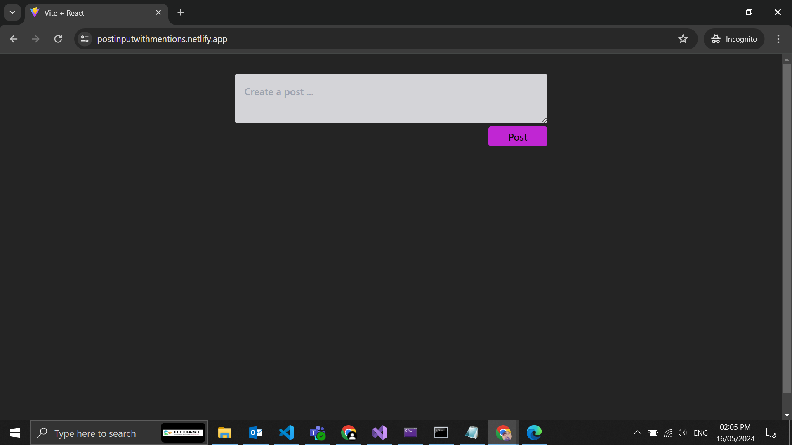
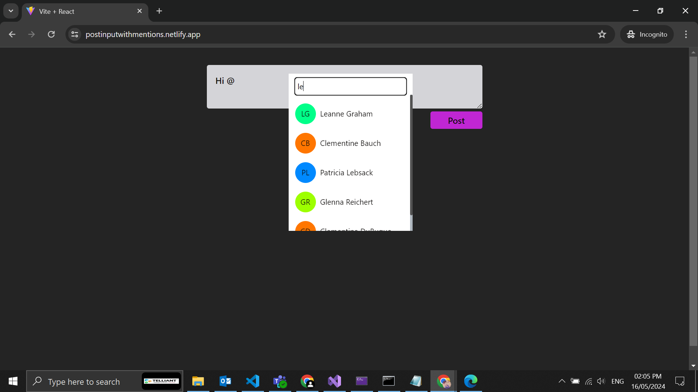
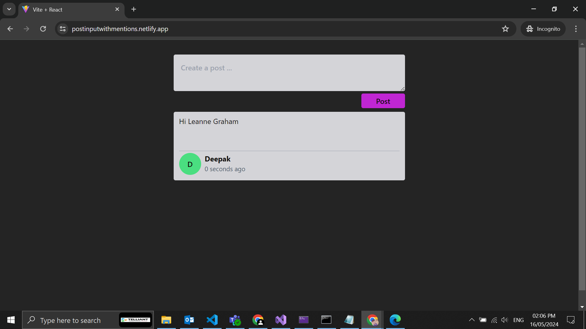

# Post Input with Mentions

## Installation

Clone the repository and install dependencies using npm:

`npm install`

## Usage

Start the development server:

`npm run dev`

This will open the app in your default browser.

Build the app for production:

`npm run build`

Preview the production build:

`npm run preview`

